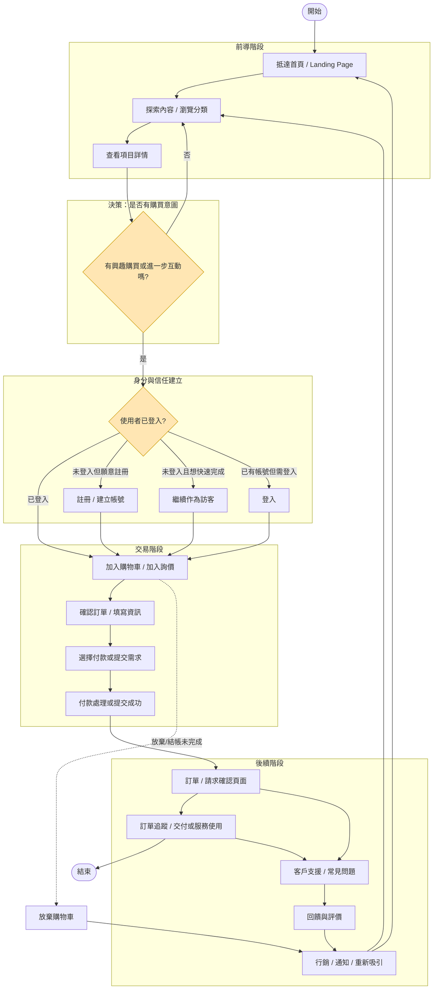

# 台灣公司查詢系統 - 雙 API 版本

這是一個整合多個資料來源的台灣公司查詢系統，支援：
1. **第三方 API** - opendata.vip 和 g0v 資料
2. **財政部/經濟部開放資料** - 官方商工登記資料

## 🚀 功能特色

- ✅ 雙資料來源切換
- ✅ 支援公司名稱或統一編號查詢
- ✅ 即時查詢結果
- ✅ 響應式設計（支援手機、平板、電腦）
- ✅ 錯誤處理與備用方案

## 📦 技術棧

- **框架**: Next.js 14 (App Router)
- **語言**: TypeScript
- **樣式**: Tailwind CSS
- **HTTP 請求**: Axios

## 🛠️ 安裝步驟

### 1. 安裝相依套件

```bash
npm install
```

### 2. 啟動開發伺服器

```bash
npm run dev
```

### 3. 開啟瀏覽器

訪問 [http://localhost:3000](http://localhost:3000)

## 📋 API 說明

### 第三方 API

**主要來源**: opendata.vip
- 優點：免申請、即用即查
- 缺點：覆蓋範圍可能有限

**備用來源**: g0v 公司資料
- 優點：開放資料、社群維護
- 缺點：更新頻率不確定

### 財政部/經濟部資料

**主要來源**: 經濟部商工登記 API
- 優點：官方資料、最權威
- 缺點：**需要申請權限**（請至 https://data.gcis.nat.gov.tw/ 填寫使用告知書）

**備用方案**: 其他政府開放資料
- 如果沒有 API 權限，系統會嘗試其他來源

## 🔍 使用方式

### 查詢公司名稱
```
輸入：台積電
或
輸入：台灣積體電路
```

### 查詢統一編號
```
輸入：97176009
```

## 📊 查詢結果包含

- 統一編號
- 公司名稱
- 公司狀態
- 資本額
- 代表人
- 公司地址
- 設立日期
- 營業項目（部分資料源）

## 🚢 部署到 Vercel

### 方法 1: 使用 Vercel CLI

```bash
# 安裝 Vercel CLI
npm install -g vercel

# 部署
vercel --prod
```

### 方法 2: GitHub 整合

1. 將專案推送到 GitHub
2. 在 Vercel Dashboard 匯入專案
3. 自動部署

## ⚙️ 環境變數（選用）

如果你有申請到經濟部 API 權限，可以設定：

```env
# .env.local
GCIS_API_KEY=your_api_key_here
```

## 📝 注意事項

### 關於經濟部 API

如果想要使用官方經濟部資料，需要：

1. 前往 https://data.gcis.nat.gov.tw/
2. 下載並填寫「使用告知書」
3. 寄送至 opendata.gcis@gmail.com
4. 提供你的外部 IP 位址
5. 等待審核（通常 1-3 天）

### API 限制

- 第三方 API 可能有查詢頻率限制
- 經濟部 API 需要 IP 白名單
- 建議兩種來源都試試看

## 🤝 貢獻

歡迎提交 Issue 或 Pull Request！

## 👨‍💻 作者

**Tao Chun Liu** - PM Mayors

## 📄 授權

MIT License

## 🔗 相關連結

- [經濟部商工資料開放平台](https://data.gcis.nat.gov.tw/)
- [政府資料開放平台](https://data.gov.tw/)
- [Next.js 文件](https://nextjs.org/docs)

---

**提示**：如果第三方 API 無法使用，建議改用「財政部資料」選項，或申請經濟部 API 權限以獲得最佳體驗。

# 使用者旅程 (High-Level User Journey)

下圖為高階（High-Level）、聚焦使用者旅程（User Journey）的 Mermaid 流程圖。已刻意忽略技術與實作細節，僅描述使用者在網站/服務上的典型路徑與主要分支／回路。

> 如果你的平台是 GitHub README，GitHub 會直接渲染 Mermaid 圖；如果你的瀏覽器或環境不支援，可改為放一張匯出的 SVG/PNG 圖片。



簡短說明：
- 前導階段：使用者從首頁進入，探索並查看商品/服務詳情。
- 決策與身分：是否有興趣進行下一步；若要交易則處理登入/註冊或訪客流。
- 交易階段：加入購物車／發起詢價、填單、付款或提交請求。
- 後續階段：確認、追蹤、客服、回饋，並由行銷/通知做重新吸引。
